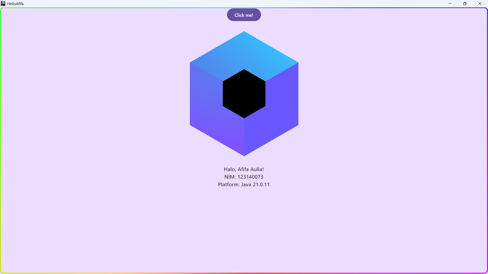

# Tugas Kotlin Multiplatform

## Identitas
- **Nama**: Afifa Aulia
- **NIM**: 123140073

## Deskripsi Proyek
Proyek tugas Minggu 1 mata kuliah Pengembangan Aplikasi Mobile. Aplikasi dibuat menggunakan **Kotlin Multiplatform (KMP)** dengan **Compose Multiplatform**, sehingga satu basis kode UI (di folder `shared`) dapat dijalankan di berbagai platform (Android dan Desktop).

Aplikasi menampilkan:
- Nama pengguna
- NIM pengguna
- Nama platform yang sedang digunakan untuk menjalankan aplikasi (memanfaatkan mekanisme `expect`/`actual` di Kotlin Multiplatform)

## Struktur Proyek
- `androidApp` — modul aplikasi Android (entry point: `MainActivity.kt`)
- `desktopApp` — modul aplikasi Desktop
- `shared` — kode UI (Compose Multiplatform) dan logika yang dipakai bersama oleh Android & Desktop

## Platform yang Berhasil Dijalankan
- Desktop (JVM)

## Screenshot Hasil Run

## Teknologi yang Digunakan
- Kotlin Multiplatform
- Jetpack Compose / Compose Multiplatform
- Android Studio (Quail 4 | 2026.1.4)